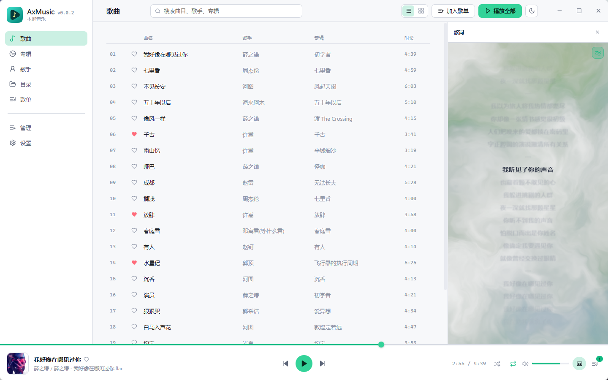
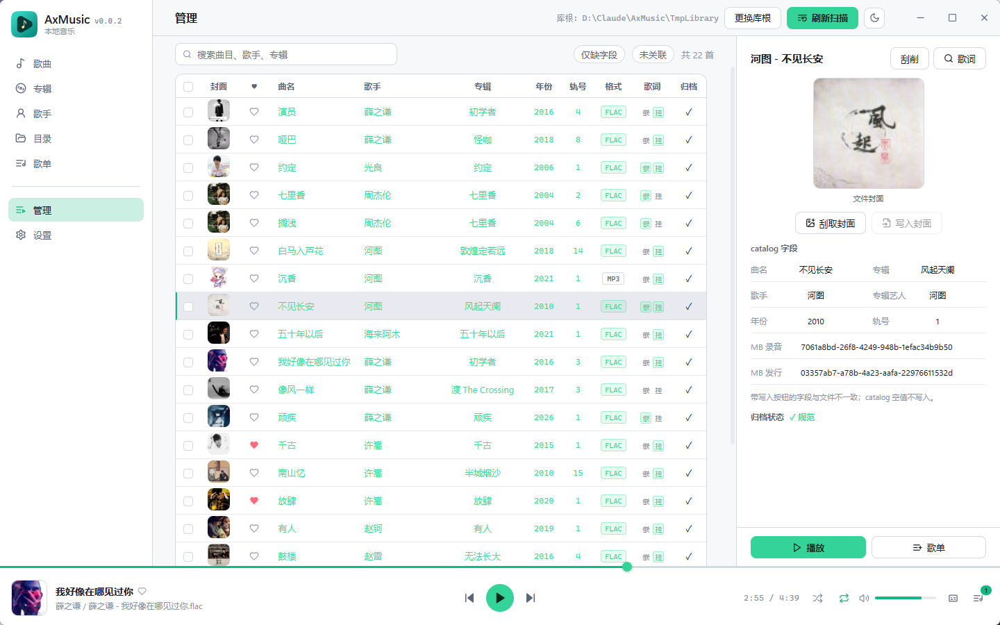
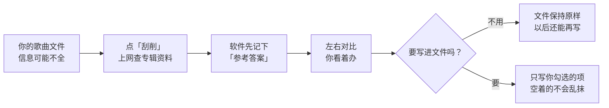

<div align="center">
  
  <h1>AxMusic</h1>
  <p><strong>Windows 本地音乐播放器 + 洗库管理工具</strong></p>
  <p>绿色单文件 · 以 FLAC 为主，兼顾 MP3 / M4A / Opus · 打开就能听，进「管理」收拾干净</p>
  <p>
    
    
    
  </p>
</div>

## 📸 截图

| 歌曲列表（浅色） | 管理洗库（浅色） |
| :---: | :---: |
|  |  |

| 专辑墙（暗色） | 满窗播放 |
| :---: | :---: |
|  |  |

## ✨ 特性

**🎵 播放**
- 任意路径音频打开即播，不依赖曲库；FLAC / MP3 / M4A / Opus
- 顺序 / 随机 / 单曲循环；迷你播放条常驻，满窗播放页封面 + 滚动歌词
- 外挂 `.lrc` 歌词优先，支持内嵌歌词读写、嵌↔挂互转
- 托盘驻留，关闭可询问；库外歌曲可一键「纳入库管理」

**🖼️ 浏览**
- 歌曲网格 / 列表、专辑墙与专辑详情、歌手、目录树（递归 / 多选 / 批量入歌单）
- 歌单管理；系统「喜爱」歌单置顶，全列表心形切换

**🛠️ 管理（洗库工作区）**
- 库目录向导 → 扫描建档（SQLite 仅作工作区，播放不依赖）
- 标签 / 封面对比编辑：右侧对比面板勾选字段后写入，**空值永不覆盖**已有标签
- 歌词三源聚合搜索：LRCLIB / 网易云 / QQ 音乐并发请求，流式回显，先回先显示
- MusicBrainz 刮削：候选整张先入本地 catalog，确认采纳才写文件；限速 ≤1 req/s 合规访问

**📦 绿色便携**
- 单文件 exe，解压即用；应用数据全部放在 `exe 同目录/data/`，不写注册表、不污染系统

## 🧠 它是怎么帮你整理歌的？

不用懂技术，记住一句话就行：

> **上网查到的资料，先记在软件里；你点头之后，才写进歌曲文件。**

刚买来的、网上下的歌，文件里的歌名、歌手、专辑、封面经常缺一块或者写错。AxMusic 的「管理」就是帮你对答案、补作业——但**不会自作主张改你的歌**。

### 整理一首歌，大概长这样



**两件让人放心的事：**

1. **查资料不动文件** —— 刮削完歌曲文件还是原来的，顶多在软件里多了一份「参考答案」
2. **空的不会覆盖有的** —— 万一网上资料缺歌手，不会把你已经写好的歌手抹成空白

### 管理表里的绿字是什么？

| 你看到的 | 意思 |
| --- | --- |
| **绿字** | 文件里写的信息，和网上查到的一致 |
| 普通字 | 和网上不一致（以文件为准，你说了算） |
| 灰色 `—` | 这一项是空的 |

选中一行，右侧就是**左右对比**：左边文件里现在写的，右边网上查到的。勾上想改的，点「写入文件」——一次只写你同意的那几项。

### 歌词也是一样的道理

点「🔍 歌词」→ 三个歌词站一起搜 → 先出来的先显示 → 选一条试听/看一眼 → 保存。

默认存成旁边的 `.lrc` 文件（兼容性好，不动音频）；想嵌进歌曲标签里也可以，两者能互转。

### 喜欢的歌怎么进库？

听歌不需要建库，**任何地方的歌都能直接播**。觉得某首歌不错、想长期整理，再在播放条上点「纳入库管理」，把它收进你的音乐文件夹。

### 音乐文件夹里会有什么

选一个文件夹当「库」后，大概长这样（都是正常文件夹，拷走还能听）：

```text
我的音乐/                    ← 就是你选的库
  archived/                 整理好的歌：歌手/歌手 - 歌名.flac
  Unarchived/               还没整理的，先放这儿
  lrc/                      歌词文件
  covers/                   封面图片
  playlists/                歌单
```

整理（归档）会把歌挪到规范位置；歌单里的旧路径会自动跟上。万一还对不上，打开歌单时软件会按「歌手 + 歌名」再找一遍，找回来就修好，真没了才标「缺失」。

## 🔨 从源码构建

环境要求：Node.js ≥ 18、Rust stable、[Tauri 2 前置依赖](https://tauri.app/start/prerequisites/)（MSVC Build Tools + WebView2）。

```bash
npm install
npm run tauri dev      # 开发调试
build-release.bat      # 发布构建，绿色版输出到 out/AxMusic-v*.exe
```

## 🧰 技术栈

| 层 | 选型 |
| --- | --- |
| 应用壳 | Tauri 2（Rust） |
| 前端 | React 18 · TypeScript · Vite · zustand |
| 标签读写 | lofty |
| 音频解码 / 输出 | Symphonia / cpal |
| 工作库 | rusqlite（bundled SQLite，存于 `<库根>/axmusic.db`） |
| 刮削网络 | reqwest（blocking，限速 ≤1 req/s） |

## 📚 文档

| 文档 | 内容 |
| --- | --- |
| [docs/产品需求.md](docs/产品需求.md) | 定位、功能、库目录流程、整理规则、验收 |
| [docs/技术架构.md](docs/技术架构.md) | 技术栈、播放引擎、数据源、数据模型、绿色版打包 |
| [docs/界面设计.md](docs/界面设计.md) | 暗色 UI、布局、Token、关键界面 |
| [docs/开发计划.md](docs/开发计划.md) | 已定决策、里程碑、开工顺序 |

## 🙏 致谢

- [MusicBrainz](https://musicbrainz.org/) 开放音乐元数据库
- [LRCLIB](https://lrclib.net/) 免费同步歌词库，以及网易云音乐、QQ 音乐的公开歌词接口
- [Tauri](https://tauri.app/)、[lofty](https://github.com/Serial-ATA/lofty-rs)、[Symphonia](https://github.com/pdeljanov/Symphonia) 等开源项目

## 📄 许可

[MIT](LICENSE) © AxMusic contributors
